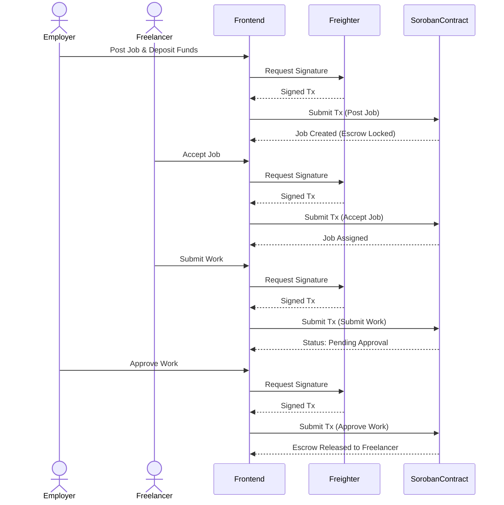

# System Architecture

This document provides a high-level overview of the system architecture, component interactions, and the data lifecycle for the platform.

## System Components

Our application is built on a decentralized architecture consisting of three main layers:

1. **Frontend (Next.js)**: The user-facing application built with React and Next.js. It handles user interactions, wallet connectivity, and off-chain data management.
2. **Soroban RPC Layer**: Acts as the bridge between the frontend and the Stellar network. It forwards transactions to the network, simulates contract calls, and reads on-chain state.
3. **Smart Contract (Soroban)**: The on-chain Rust contract deployed on the Stellar network. It enforces the core business logic, manages the Escrow, and holds the authoritative state of Jobs.

## Data Split: On-chain vs Off-chain

To optimize costs and performance, data is strategically split:

- **On-chain Data (Soroban Contract)**: Contains only the critical financial and state data necessary for trustless execution. This includes the `Job` struct containing IDs, statuses, wallet addresses of the employer and freelancer, and escrow amounts.
- **Off-chain Data (localStorage / Backend)**: Contains heavy metadata that does not require on-chain consensus, such as detailed job descriptions, titles, images, and user profiles. The frontend matches off-chain metadata with on-chain IDs.

## Wallet Integration (Freighter)

Wallet connectivity is handled via the Freighter wallet (`@stellar/freighter-api`). 

1. **Connection**: Users connect their Freighter wallet to authenticate.
2. **Transaction Signing**: When a user performs an on-chain action (e.g., funding a job), the frontend constructs the transaction and prompts the user to sign it via the Freighter extension.
3. **Network Submission**: The signed transaction is then submitted to the Soroban RPC.

## Job & Escrow Lifecycle

The core mechanism of the platform relies on a smart contract Escrow.

1. **Post**: An employer creates a job and deposits funds into the contract's escrow.
2. **Accept**: A freelancer accepts the job, updating the on-chain state to link their address.
3. **Submit**: The freelancer submits their completed work.
4. **Approve/Cancel**: The employer reviews the work. If approved, funds are released to the freelancer. If cancelled/disputed, funds can be returned to the employer (depending on dispute resolution rules).

### Flow Diagram

